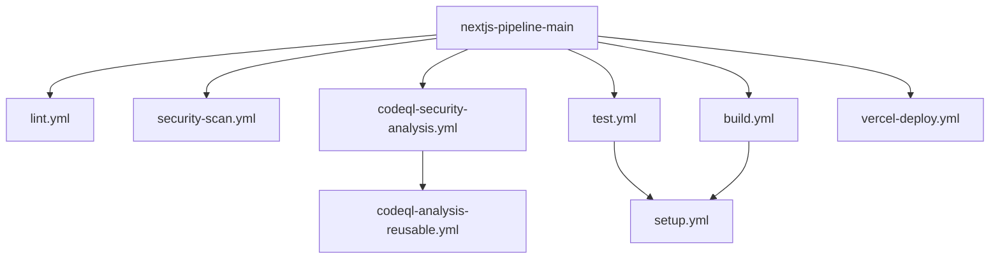

# Next.js CI/CD Pipeline Architecture

This document explains the architecture of our modular GitHub Actions CI/CD pipeline for Next.js projects deployed to Vercel.

## Architecture Overview

Our CI/CD pipeline follows a modular approach, where workflows are broken down into reusable components that can be composed together. This
pattern offers several advantages:

- **Maintainability**: Changes to a specific part of the pipeline only need to be made in one place
- **Consistency**: The same workflow is used across all repositories
- **Flexibility**: Repositories can customize parameters without duplicating workflow code
- **Simplicity**: Each workflow focuses on a specific concern

## Workflow Structure

### Core Pipeline Workflow

The main entry point is `nextjs-pipeline-main.yml`, which organizes the pipeline into logical stages:

1. **Validation Stage** (Parallel)

   - Code linting (Eslint, Prettier)
   - Security scanning (TruffleHog, Snyk)
   - CodeQL analysis

2. **Test Stage**

   - Unit and integration tests
   - Coverage reporting

3. **Build Stage**

   - Next.js build
   - Asset compilation

4. **Deployment Stage** (Conditional)
   - Preview deployment (PR)
   - Staging deployment (develop branch)
   - Production deployment (main branch)

### Reusable Workflows

Our pipeline consists of these reusable workflows:

| Workflow                       | Purpose                                     |
| ------------------------------ | ------------------------------------------- |
| `setup.yml`                    | Sets up the Node.js environment and caching |
| `lint.yml`                     | Runs code quality checks                    |
| `security-scan.yml`            | Performs security scanning                  |
| `codeql-security-analysis.yml` | Runs CodeQL static analysis                 |
| `test.yml`                     | Runs test suite (supports matrix testing)   |
| `build.yml`                    | Builds the Next.js application              |
| `vercel-deploy.yml`            | Handles Vercel deployment                   |
| `release-drafter.yml`          | Generates release notes                     |
| `release.yml`                  | Manages the release process                 |

## Workflow Interdependencies



## Standard Configuration

All workflows standardize on:

- **Node.js**: Using version 20 as the default
- **Action Versions**: Using consistent, up-to-date versions
- **Caching**: Optimized caching for npm and build outputs
- **Error Handling**: Consistent error reporting

## Using the Pipeline

To use this pipeline in a Next.js project:

1. Import the workflow in your repository's `.github/workflows/ci.yml`:

```yaml
name: CI/CD Pipeline

on:
  push:
    branches: [main, develop]
  pull_request:
    branches: [main, develop]

jobs:
  pipeline:
    uses: navigaite/workflow-test/.github/workflows/nextjs-pipeline-main.yml@main
    with:
      node-version: 20
    secrets:
      github-token: ${{ secrets.GITHUB_TOKEN }}
      vercel-token: ${{ secrets.VERCEL_TOKEN }}
      snyk-token: ${{ secrets.SNYK_TOKEN }}
```

## Customization Points

Each workflow accepts input parameters to customize its behavior, allowing repositories to:

- Specify Node.js versions
- Adjust build and test commands
- Control deployment environments
- Configure security scan thresholds

## Best Practices

1. Use the main pipeline workflow when possible instead of individual workflows
2. Keep custom configurations in consuming repositories, not in workflow code
3. Update to new major versions intentionally, not automatically
