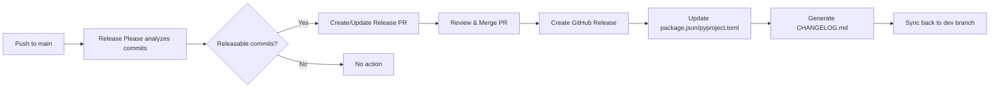

# 🏷️ Versioning Guide

This document explains how semantic versioning works in the Universal Pipeline v2.

## Overview

The pipeline uses **[Release Please](https://github.com/googleapis/release-please)** by Google to automate version management based on
**Conventional Commits**.

## How It Works

### 1. Commit Messages Drive Versioning

Every push to `main` triggers the release automation. The version bump is determined by your commit messages:

| Commit Type        | Version Bump              | Example                            |
| ------------------ | ------------------------- | ---------------------------------- |
| `feat:`            | **Minor** (1.0.0 → 1.1.0) | `feat: add dark mode toggle`       |
| `fix:`             | **Patch** (1.0.0 → 1.0.1) | `fix: resolve login timeout issue` |
| `perf:`            | **Patch** (1.0.0 → 1.0.1) | `perf: optimize database queries`  |
| `BREAKING CHANGE:` | **Major** (1.0.0 → 2.0.0) | See below                          |

### 2. Breaking Changes (Major Version Bump)

To trigger a major version bump, add `BREAKING CHANGE:` in the commit footer:

```
feat: redesign API endpoints

BREAKING CHANGE: The /api/v1/users endpoint has been removed.
Use /api/v2/users instead.
```

Or use the `!` shorthand:

```
feat!: redesign API endpoints
```

### 3. Release Workflow



### 4. Release PR Example

When you push commits to `main`, Release Please automatically:

1. **Creates a Release PR** with:
   - Updated version in `package.json` (or equivalent)
   - Generated `CHANGELOG.md` entry
   - List of all commits since last release

2. **Updates the PR** on subsequent pushes (accumulates commits)

3. **Creates the Release** when you merge the PR:
   - Tags the commit (e.g., `v1.2.0`)
   - Creates GitHub Release with notes
   - Syncs version updates back to `dev` branch

## Configuration

### Release Please Config

**File:** `.github/release-please-config.json`

```json
{
  "release-type": "node",
  "packages": {
    ".": {
      "changelog-sections": [
        { "type": "feat", "section": "✨ Features" },
        { "type": "fix", "section": "🐛 Bug Fixes" },
        ...
      ]
    }
  }
}
```

### Pipeline Config

**File:** `.github/pipeline.yaml`

```yaml
release:
  enable: true
  type: node # or python, simple
  sync_to_dev: true
  sync_target_branch: dev
```

## Conventional Commit Format

```
<type>(<scope>): <subject>

<body>

<footer>
```

### Types

| Type       | Description             | Changelog        | Version |
| ---------- | ----------------------- | ---------------- | ------- |
| `feat`     | New feature             | ✨ Features      | Minor   |
| `fix`      | Bug fix                 | 🐛 Bug Fixes     | Patch   |
| `perf`     | Performance improvement | ⚡ Performance   | Patch   |
| `docs`     | Documentation           | 📚 Documentation | None    |
| `refactor` | Code refactoring        | ♻️ Refactoring   | None    |
| `test`     | Tests                   | Hidden           | None    |
| `build`    | Build system            | Hidden           | None    |
| `ci`       | CI/CD changes           | Hidden           | None    |
| `chore`    | Maintenance             | Hidden           | None    |
| `style`    | Formatting              | Hidden           | None    |
| `revert`   | Revert previous commit  | ⏪ Reverts       | Patch   |

### Examples

#### Feature (Minor Bump)

```
feat(auth): add OAuth 2.0 support

Implements OAuth 2.0 authentication flow with support for
Google, GitHub, and Microsoft providers.

Closes #123
```

#### Bug Fix (Patch Bump)

```
fix(api): resolve race condition in cache

The cache was not being properly invalidated when multiple
requests updated the same resource simultaneously.

Fixes #456
```

#### Breaking Change (Major Bump)

```
feat(api)!: redesign user endpoints

BREAKING CHANGE: The following endpoints have changed:
- /users → /api/v2/users
- /user/:id → /api/v2/users/:id

Migration guide: https://docs.example.com/migration
```

#### Refactor (No Bump)

```
refactor(core): extract utility functions

Moved common utility functions to shared module for
better code organization.
```

## Auto-Sync to Dev

After a release is created on `main`:

1. **Version files are updated** (package.json, pyproject.toml)
2. **CHANGELOG.md is generated**
3. **Automatic merge** from `main` to `dev` occurs
4. **Commit message** includes `[skip ci]` to prevent loops

This ensures `dev` branch always has the latest version numbers.

## Manual Version Control

### Force a Specific Version

Edit `.github/release-please-config.json`:

```json
{
  "packages": {
    ".": {
      "release-as": "2.0.0"
    }
  }
}
```

### Skip a Release

Add `Release-As: 1.x` to the release PR body to prevent release creation.

## Troubleshooting

### "No release created"

**Causes:**

- No releasable commits (only chore/docs/test)
- Release PR is still open
- No changes since last release

**Solution:**

- Merge the open Release PR
- Make commits with feat/fix types

### "Version didn't increment"

**Cause:** Commit message doesn't follow conventional format

**Solution:**

- Check commit message format
- Use `feat:` or `fix:` prefix
- Ensure commitlint is passing

### "Wrong version bump"

**Cause:** Incorrect commit type

**Solution:**

- `feat:` for new features (minor)
- `fix:` for bug fixes (patch)
- `BREAKING CHANGE:` for breaking changes (major)

## Best Practices

✅ **Always use conventional commits** on `main` branch ✅ **Review the Release PR** before merging ✅ **Keep changelog up to date**
(automatic with Release Please) ✅ **Tag releases consistently** (automatic) ✅ **Sync main → dev regularly** (automatic)

❌ **Don't manually edit CHANGELOG.md** ❌ **Don't create tags manually** ❌ **Don't skip the Release PR** ❌ **Don't force-push to main**

## Resources

- [Release Please Documentation](https://github.com/googleapis/release-please)
- [Conventional Commits Specification](https://www.conventionalcommits.org/)
- [Semantic Versioning](https://semver.org/)
- [Commitlint](https://commitlint.js.org/)

---

**Questions?** Open an issue or check the [GETTING_STARTED.md](./GETTING_STARTED.md) guide.
